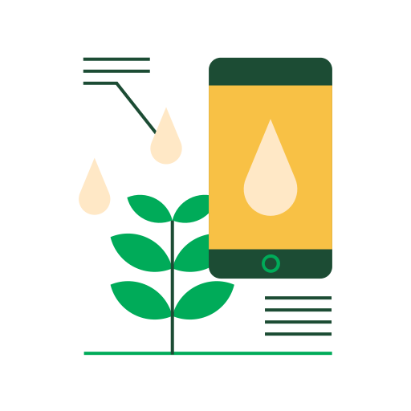

Web App Smart Home
==================

Este proyecto es una aplicación web fullstack que se ejecuta sobre el ecosistema `Docker`. 
Utiliza el `Framework Ionic` para realizar el frontend. También tiene un servicio en `NodeJS` que permite ejecutar código en backend y al mismo tiempo disponibilizar el código del cliente web para interactar con el servicio. Además tiene una `base de datos` MySQL que permite interactuar con el backend para guardar y consultar datos, y de manera adicional trae un `administrador` de base de datos para poder administrar la base en caso que lo necesites.

# Introducción

El proyecto corresponde al trabajo final de la asignatura **Desarrollo de Aplicaciones Multiplataforma** de la *Especialización en Internet de las Cosas* dictada en la *Facultad de Ingenieria* de la *Universidad de Buenos Aires*.

El sistema permite:
- controlar la apertura y cierre de la electroválvula de diferentes dispositivos,
- ver las mediciones de cada dispositivo y
- ver el logs de operaciones sobre la electroválvula.

## Contribuir 🖇️

Si desea participar del proyecto, por favor realizar un pull request con las sugerencias y el código.

## Autor 👥

*  **Martin Anibal Lacheski - Año 2024**

## Icono
<a href="https://www.flaticon.es/iconos-gratis/iot" title="iot iconos">Iot iconos creados por Chanut-is-Industries - Flaticon</a>

## Licencia 📄

Este proyecto está bajo Licencia ([MIT](https://choosealicense.com/licenses/mit/)).

---
